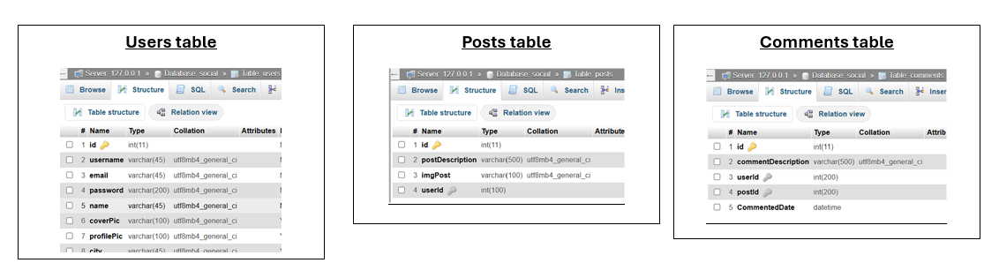

# SERVER SIDE DOCUMENTATION

## Table of Contents

1. [Introduction](#introduction)
2. [Installation](#installation)
3. [Creating the database](#creating-the-database)
4. [API](#api)
5. [Testing the API](#testing-the-api)
6. [Challenges](#challenges)

## Introduction

This is the server side of the project. It is a RESTful API that provides the following functionalities:

- User registration
- User login
- User logout
- User profile update
- User creation of a new post
- User deletion of a post
- User update of a post
- User retrieval of all posts
- User comment on a post
- User deletion of a comment
- User update of a comment

The server is built using Node.js, Express.js and myPHPAdmin. The server is connected to a MySQL database that stores all the user and post information.

## Installation

To install the server, you need to have Node.js and npm installed on your machine. You can download Node.js and npm from the following link: https://nodejs.org/en/download/

The following packages were used to build the server:

- **<ins>Express</ins>** is a minimal and flexible Node.js web application framework that provides a robust set of features for web and mobile applications.

- **<ins>mysql2</ins>** is a Node.js library that provides a fast and efficient way to interact with MySQL databases (MySQL2 is a drop in replacement to MySQL).

- **<ins>Cors</ins>** is a node.js package for providing a Connect/Express middleware that can be used to enable CORS with various options. CORS means <ins> Cross-Origin Resource Sharing</ins>.

## Creating the database

The database used in this project is a MySQL database which I used myPHPAdmin to create. As shown below

{ width=200px height=100px }

In the images you can see that some tables has foreign keys that are linked to other tables. The database has the following tables:

- User id is linked to the post table and the comment table.
- Post id is linked to the comment table.
- Comment id is linked to the user table and the post table.

## API

The server has the following endpoints:

- **<ins>POST</ins>** /register: This endpoint is used to register a new user. The request body should contain the following fields: username, email, password and name.

- **<ins>POST</ins>** api/auth/login: This endpoint is used to login a user. The request body should contain the following fields: username and password.

- **<ins>POST</ins>** api/auth/logout: This endpoint is used to logout a user.

- **<ins>PUT</ins>** api/auth/:id This endpoint is used to update a user's profile. The request body should contain the following fields: username, email, password, name profile picture, cover picture, city and website.

- **<ins>POST</ins>** /api/posts/: This endpoint is used to create a new post. The request body should contain the following fields: postDescription and userId.

- **<ins>DELETE</ins>** /api/posts/:postId: This endpoint is used to delete a post but for only the user that has created the post.

- **<ins>PUT</ins>** /api/posts/:postId: This endpoint is used to update a post but for only the user that has created the post.

- **<ins>GET</ins>** /api/posts/: This endpoint is used to retrieve all posts.

- **<ins>POST</ins>** api/comments/: This endpoint is used to comment on a post. The request body should contain the following fields: commentDescription, postId and userId.

- **<ins>DELETE</ins>** /api/comments/:commentId: This endpoint is used to delete a comment but for only the user that has created the comment.

- **<ins>PUT</ins>** /api/comments/:commentId: This endpoint is used to update a comment but for only the user that has created the comment.

## TESTING THE API

To test the API, I used the Insomnia REST client. You can download Insomnia from the following link: https://insomnia.rest/download/

Please see videos please

**Register and login** - 

**All posts requests** - 

**All commment requests** - 

## Challenges

I have found working on the server side to be very interesting and challenging. I have learned a lot about how to build a RESTful API and how to connect it to a database. I have re-learned on how to use the Insomnia REST client to test the API.
